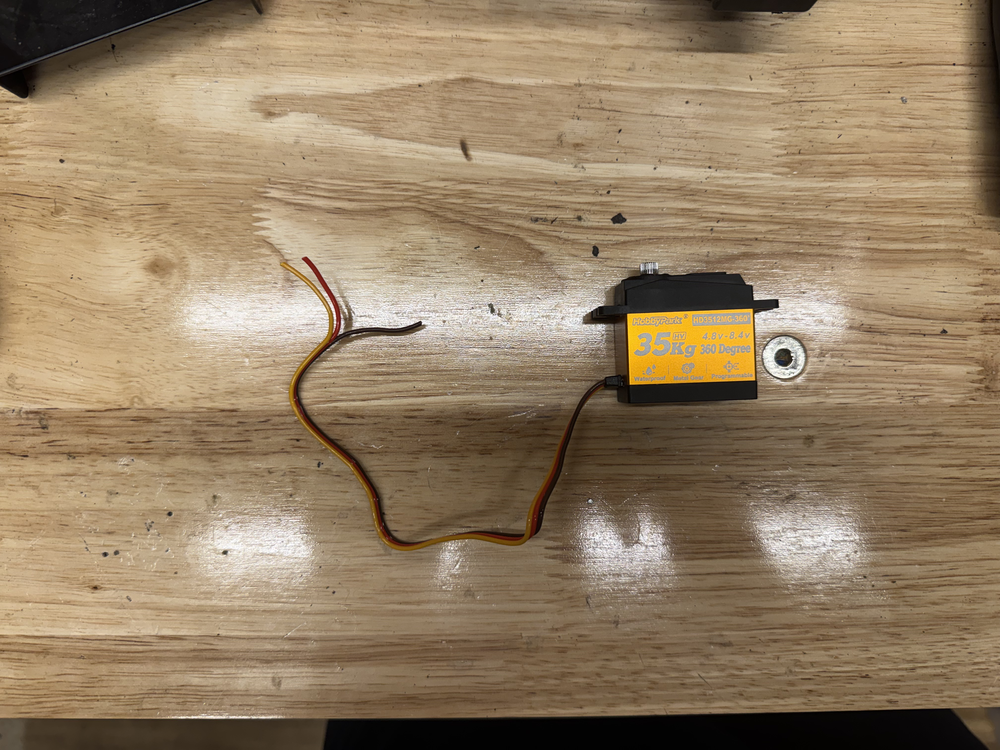
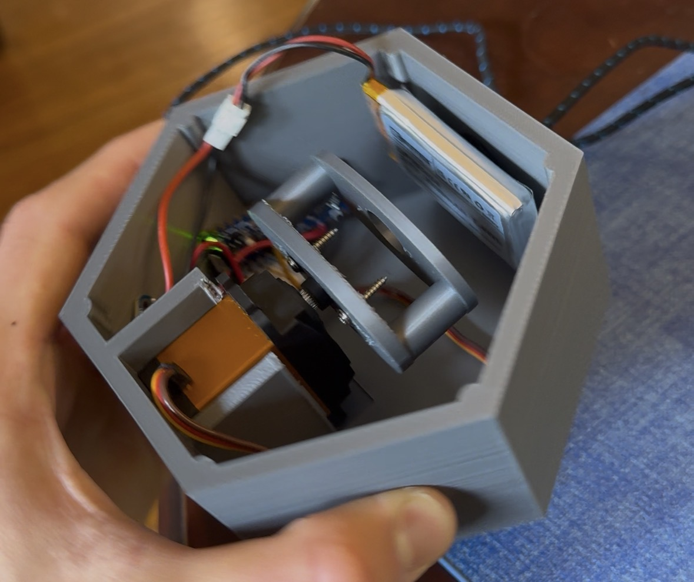

## General Overview
The project has been in the works for about a month or so now. The initial problem that needed to be solved was to control descent of the rocket to within the designated threshold by ARC (the last year was 36-39s). Our previous solution to controlling descent time was to place a zip tie progressively higher up on the parachute shroud lines, which should reduce the amount the parachute opens up and therefore increase descent time. However, a huge factor at play is sudden gusts of wind, which messed with our final qualification flight - we had a launch with perfect time of descent, and then reefed the parachute MORE, and then the time of descent increased. This means that the time of descent must be controlled onboard the rocket, instead of hoping to get lucky with weather. Thus, the idea of dynamic reefing came about. 

## Conceptual Solution
The current theoretical solution thus far has been threading a Kevlar string (typically used for shock cord) around the circumference of the parachute, and then winching in that string with a servo onboard the rocket in order to effectively decrease circumference of the parachute → lowering surface area → decreasing descent time. This would then be controlled by the onboard avionics which would attempt to predict, after a few seconds of coasting, if the rocket will touch down to the ground at the required time (safely). There will likely be a ‘hard stop’ in the code which will prevent the rocket from shattering upon descent.

## Current Steps
The current step in development is creating an overkill proof of concept. A simple payload with space for a 27 kg/cm servo (which in itself weighs approx 70g, quite heavy for our needs) has been CADded and printed out of lightweight PLA. The winch went through multiple iterations, starting with an ellipsoidal cross section a few times before I realized that it would result in uneven thread pull, before finally landing on a spool thread-like design (after further reflection, this makes by far the most sense and it is strange that I decided against it initially). 

*35 kg/cm servo, quite strong*

*Crude prototype of reefing mechanism*

The first parachute attached was a bog standard 18” ripstock nylon parachute made by Apogee. 

Using the basic formula for terminal velocity (vt = √(2mg / (pACd)), plugging in standard values for p (air density, 1.225 kg/m³) and Cd (standard drag coefficient, 1.5) for a hemispherical parachute, a mass of approximately 240g, and approximating projected surface area to be around 0.7x of total surface area, we get a vt of (√((2 * 0.240kg * 9.81m/s2)/(1.225 kg/m³ * 0.115 m2 * 1.5)) = 4.72 m/s. This was accurately depicted in our drop tests of the payload with such a parachute, in which we realized that we would have very little window to determine any modulations in descent time with the reefing. We thus decided on making our own makeshift parachutes - ordering every time we need a different size from Apogee takes at least several weeks, and we would be able to customize the diameter perfectly. Our first parachute was made out of Amazon ‘kite’ nylon with a 40cm radius, quadrupling surface area from our previous 46cm DIAMETER parachute and thus reducing terminal velocity by a factor of 2. 

*Our custom parachute made out of lightweight nylon*

Grommets are used along the circumference of the parachute for both attachment of shroud lines and threading of the reefing line. One noticeable concern as of now is the management of different lines - even in the small scale 18” parachute there was considerable entanglement of the shroud and reefing lines. This will likely be the most difficult issue to deal with, as the line management will only get more complex as we move from this prototype to enstating the same system within a body tube of a narrow rocket at an imperfect orientation. 

*Example of the difficulties with reefing and shrouding lines. They can get very tangled very quickly*
