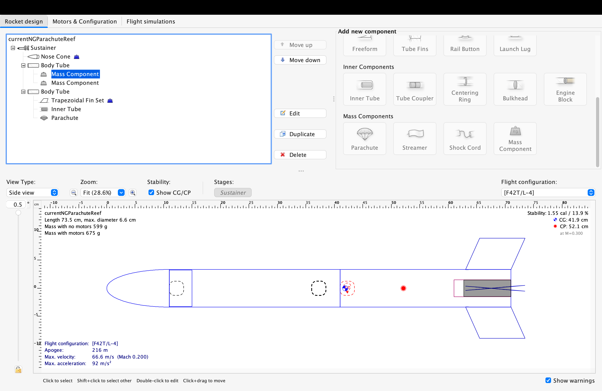
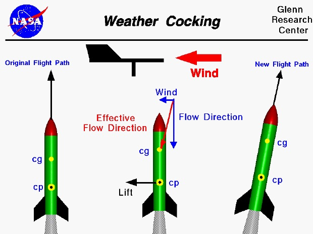

# Progress Report #3
We have decided to bite the bullet and construct an entire rocket to test the effectiveness of the reefing design. It would have been much more preferred to use a small-scale prototype, but with significant time constraints (my teammate’s college departure) production has been rushed to making a full rocket with the integrated reefing mechanism. The first step in the construction of this rocket, as always, is to plug in basic parameters into the software OpenRocket, which will calculate/approximate basic stability and apogee details. 

The most crucial details when designing a basic rocket like this are the weights of individual components (fins, nose cone, ‘mass component’ in the center to represent avionics, etc) and then match them as closely as possible in the real world. This can be achieved through modifying infill and print material with FDM printing. 

The aerodynamic stability of the rocket, measured in calibers, is approximately 1.52, which is considered well within the ‘sweet spot’ of 1-2 calibers for model rockets to both remain . This value simply measures how many rocket body (body tube) diameters the center of gravity is ahead of the center of pressure. This value is important as it ensures the rocket won’t tumble due to being under stable or ‘weathercock’ (turn into the wind due to stability being too high). The intuitive explanation can be given through this NASA model rocketry diagram: 

